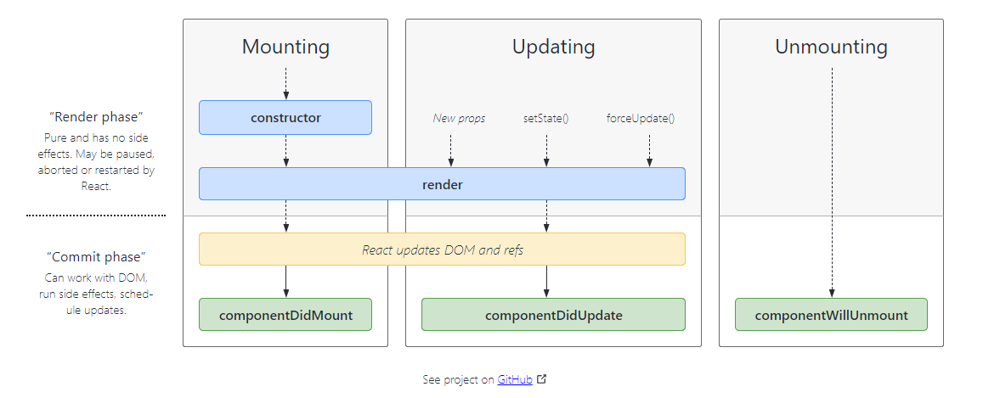

React的生命周期主要分为三个阶段，分别为**挂载**、**更新**和**卸载**

# 挂载

挂载意味着将元素放入DOM中。

React中有一些内置的方法会在元素挂载的时候执行，它们的名称与顺序是

1. constructor() => Init dat
2. getDerivedStateFromProps()
3. render()
4. componentDidMount() => Method After render()

https://projects.wojtekmaj.pl/react-lifecycle-methods-diagram/

# 更新

1. static getDerivedStateFromProps()
2. shouldComponentUpdate()
3. render()
4. getSnapshotBeforeUpdate()
5. componentDidUpdate()

# 卸载

componentWillUnmount()

# 错误处理

1. static getDerivedStateFromError()
2. componentDidCatch()
